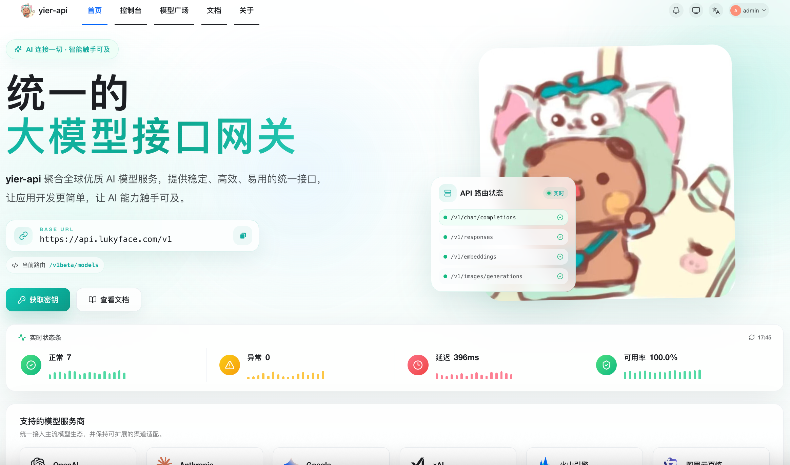

> **简体中文** | [English](README.en.md)

<p align="center">
  
  
</p>

# Gpt-Agreement-Payment

ChatGPT Plus / Team 订阅协议的端到端重放工具：从抓包逆出 `Stripe Checkout → PayPal / GoPay / QRIS → ChatGPT manual-approval → Codex OAuth + PKCE` 整条链路，并实现成可运行客户端。附带从零实现的 hCaptcha 视觉求解器、PayPal 风控早退分支、和一组真实运行采集的反欺诈机制实证数据。

[](LICENSE)
[](https://www.python.org/)
[](https://github.com/DanOps-1/Gpt-Agreement-Payment/actions)
[](#法律边界)

---

## 作者自营 API 中转站

| Logo | 名称 | 介绍 | 官网 |
| --- | --- | --- | --- |
| <a href="https://api.lukyface.com/register?aff=9ipF" target="_blank"></a> | lukyface API（作者自营中转站） | 统一的 AI 模型聚合 / 分发网关（基于 new-api），OpenAI / Claude / Gemini 三协议互转，自用余量分享。**作者自营、长期稳定**。<br><br>**对所有人开放** · 作者自营中转站交流群：**`1104565621`** | [https://api.lukyface.com/register?aff=9ipF](https://api.lukyface.com/register?aff=9ipF) |

<p align="center">
  <a href="https://api.lukyface.com/register?aff=9ipF" target="_blank">
    
  </a>
  <br>
  <sub>👆 点击图片访问 lukyface · 邀请码 <code>9ipF</code> · 交流群 <code>1104565621</code></sub>
</p>

---

> [!CAUTION]
> **使用本项目即视为同意 [`NOTICE`](NOTICE) 的全部条款。** 项目按 AS IS 提供、无任何担保、维护者不负任何责任。仅限你拥有的系统 / 合法 CTF / 授权 bug bounty 项目 in-scope 资产 / 安全研究。**严禁**用于欺诈、规避支付、批量造号转售、违反第三方 ToS、未授权目标。一切法律责任由使用者自负。不接受条款就**不要使用**。

---

## 这是什么

支持四条订阅开通路径：

| 路径 | 入口 | 用途 |
|---|---|---|
| **Team / Plus（PayPal billing agreement）** | `pipeline.py --paypal` | Stripe Checkout → PayPal billing agreement → ChatGPT manual approval |
| **Plus（promo 长链接 + PayPal 协议授权）** | `scripts/no_card_paypal_plus.py` | OpenAI 官方 promo campaign 长链接 + PayPal guest checkout 走完 billing agreement 协议 |
| **Plus / Team（GoPay 印尼）** | `pipeline.py --gopay` | Midtrans linking + GoPay 钱包绑定，IDR 区域专用 |
| **Plus / Team（QRIS 扫码）** | `pipeline.py --qris` | Midtrans QRIS，远端预览 + reference 轮询结算 |

给一个干净代理 + 一个支付凭证，命令跑完拿到 OAuth `refresh_token`。

四个值得看的点：

- **N-worker 并发 + phone-lock OTP 临界区互斥**（`webui/backend/parallel_runner.py`）。同 phone 多 worker 用 advisory lock 串行 OTP 阶段，pre/post-OTP 全并行；DB atomic claim + 占位 INSERT 防多 worker 抢同 promo_link / 同 inventory 邮箱。前端配 phone 池（M 行） + 并发数 N（可大于 M），worker 按 `i % M` 轮询映射到 phone 池。
- **hCaptcha 视觉求解器**（`CTF-pay/hcaptcha_auto_solver.py`，约 4000 行，独立可用）。VLM 主路径 + CLIP/OpenCV 启发式回退 + Playwright 人类动作合成，覆盖 12 种已知 hCaptcha 题型。
- **反欺诈机制实证数据**。IP 字符串级精确指纹、批次关联延迟封禁、probe 层 vs ban 层分离。45 个号 24 小时存活率约 2% 的实测样本，含修正模型。详见 [`docs/anti-fraud-research.md`](docs/anti-fraud-research.md)。
- **十二路自愈环 daemon**（`pipeline.py::daemon()`）。Webshare API 自动换 IP（webshare 抖时回退到 `/tmp/gost_last.json` cache）、CF DNS 配额清理、tmpfs 孤儿回收、gost 中继看门狗、DataDome 滑块自动拖拽。设计目标是无人值守跑数周。

---

## 架构

```mermaid
flowchart LR
    A[pipeline.py / webui] --> B[CTF-reg/<br/>browser_register.py<br/>Camoufox + Turnstile]
    B --> C[CTF-pay/card.py<br/>Stripe Checkout 重放]
    C --> D{支付路径}
    D -->|paypal| E1[Camoufox / Node RPA<br/>PayPal billing agreement]
    D -->|gopay| E2[Midtrans linking<br/>+ WhatsApp OTP]
    D -->|qris| E3[QRIS QR<br/>+ 远端预览]
    E1 --> F[Stripe poll<br/>state=succeeded]
    E2 --> F
    E3 --> F
    F --> G[Camoufox 二次登录<br/>Codex OAuth + PKCE]
    G --> H[refresh_token<br/>output/webui.db &#40;SQLite&#41;]
```



详细子系统拆解、文件分工、协议链路细节看 [`docs/architecture.md`](docs/architecture.md)。

---

## 现状与门槛

实事求是讲，这不是个开箱即用的工具。要把整条链路跑通，至少需要：

- 一个真实可登录的 PayPal 账号（也可走 PayPal guest checkout 协议授权流程）
- 一个出口在 EU / US / ID 的代理（按选择的支付路径锁地区）
- 一个 Cloudflare zone（可选，用于开 catch-all 子域注册邮箱；也支持 Outlook 接码池）
- 一台能跑 Camoufox + Playwright 的 Linux（约 5 GB 磁盘 + 2 GB 内存）
- （PayPal guest checkout 必需）一个 SMS 接码网关 API key，PayPal signup 用
- （GoPay 必需）一个 WhatsApp 在线号 + WhatsApp 接码服务
- （可选）一个 OpenAI 兼容的 VLM API key，hCaptcha 求解用；家宽 / 伪家宽出口通常不会触发 hCaptcha，无 VLM 时也会降级到 CLIP
- （可选）一个兼容 createTask/getTaskResult 协议的打码平台 API key，作为浏览器 passive captcha 的兜底

第一次完整跑通通常要花 1–3 小时调通配置。daemon 模式跑稳后，单次 pipeline 约 5 分钟；并发模式同 phone 跑 2 worker 约 3 分钟拿 2 个号。

代码偏研究性质，按协议阶段顺排，不追求可读性最大化。

---

## 上手

### 新手路径：webui 配置向导（推荐）

把 1–3 小时的手动调配压到 ~15 分钟。14 步 wizard + 实时 preflight 自检 + 内置运行控制器（SSE 日志流 + 并发面板），生成 `CTF-pay/config.auto.json` + `CTF-reg/config.paypal-proxy.json` 两份配置。


#### Docker 部署（最快路径，一键起）

仓库自带 `Dockerfile`（多阶段 build：node 前端 + ubuntu 24.04 runtime）+ `docker-compose.yml`，把所有系统依赖 / Playwright Chromium+Firefox / Camoufox / gost SOCKS5 中继 / Node QuickJS（OpenAI Sentinel 用）全打进镜像。host 上的 git working tree 作为单一真实源，整仓 bind mount 进容器，改完 Python 代码 `docker compose restart` 即时生效，不用重 build。

```bash
git clone https://github.com/DanOps-1/Gpt-Agreement-Payment
cd Gpt-Agreement-Payment
docker compose up -d --build
# 默认监听 127.0.0.1:8765（host 端口），浏览器开 http://127.0.0.1:8765/
# 首次访问跳 /setup 创建管理员
```

常用维护命令：

```bash
# 实时日志
docker compose logs -f webui

# 进容器调试（pip list / 跑测试 / inspect SQLite）
docker compose exec webui bash

# 改完 Python 代码后让 uvicorn 重载（bind mount 已 sync 源码，只需重启进程）
docker compose restart webui

# 改完前端代码后在容器内 rebuild dist
docker compose exec webui sh -c "cd /app/webui/frontend && npm run build"

# 完全停 + 清容器
docker compose down

# 镜像升级 (拉新 base / 升 Python 包)
docker compose build --no-cache && docker compose up -d
```

数据落盘：`output/` 是 host 目录 bind mount，里面 `webui.db`（SQLite）+ 运行结果 / 日志 host 可见可备份。`webui/frontend/dist` 和 `node_modules` 走 anonymous volume，被镜像 baked 版本覆盖（不被 host 空目录覆盖）。

公网访问（nginx 反代 + HTTPS）见 [`webui/README.md`](webui/README.md)。默认 `docker-compose.yml` 把端口绑 `127.0.0.1:8765`；要直接 `0.0.0.0` 暴露请改 `ports` 段（不建议，没认证层在前面）。

#### 手装（不用 Docker）

```bash
# 1. 后端依赖
pip install -r webui/requirements.txt

# 2. 前端构建（一次性）
cd webui/frontend && pnpm i && pnpm build && cd ../..

# 3. 启动
python -m webui.server
# 浏览器打开 http://127.0.0.1:8765 ，首次访问跳 /setup 建管理员
```

支持单 run（PayPal billing agreement / GoPay / QRIS / promo 长链接）+ 并发模式（前端配 phone 池 + 并发数 N），公网访问通过 nginx 反代见 [`webui/README.md`](webui/README.md)。

### 装

```bash
git clone https://github.com/DanOps-1/Gpt-Agreement-Payment
cd Gpt-Agreement-Payment
pip install requests curl_cffi playwright camoufox browserforge mitmproxy pybase64
playwright install firefox
camoufox fetch
```

hCaptcha 求解器的 ML 依赖（torch / transformers / opencv）建议单独装到 venv，约 4 GB：

```bash
python -m venv ~/.venvs/ctfml
~/.venvs/ctfml/bin/pip install torch transformers opencv-python pillow numpy
```

完整依赖清单和系统包看 [`docs/installation.md`](docs/installation.md)。

### 配

复制模板，填值：

```bash
cp CTF-pay/config.paypal.example.json     CTF-pay/config.paypal.json
cp CTF-reg/config.paypal-proxy.example.json   CTF-reg/config.paypal-proxy.json
```

字段含义和 schema 看 [`docs/configuration.md`](docs/configuration.md)。Docker 部署的 entrypoint 第一次启动时会自动 bootstrap 这两份 config，host 编辑后 `docker compose restart webui` 生效。

### 跑

> Docker 用户用 webui 跑就够了。下面的 CLI 命令是给本地原生跑的用户；Docker 里要跑同样命令先 `docker compose exec webui bash` 进容器。

```bash
# 1) 单次完整流程 (PayPal billing agreement)
xvfb-run -a python pipeline.py --config CTF-pay/config.paypal.json --paypal

# 2) Plus 协议授权 + promo 长链接 (走 PayPal guest checkout)
xvfb-run -a python scripts/no_card_paypal_plus.py \
    --config CTF-pay/config.paypal.json --paypal-node-rpa \
    --phone <你的号> --otp-timeout 240

# 3) N worker 并发 (同 phone 也行, OTP 阶段会 advisory lock 自动排队)
# 推荐用 webui 启动: 选并发模式, 前端配 phone 池 + concurrency N

# 4) 持续维护补号池
xvfb-run -a python pipeline.py --config CTF-pay/config.paypal.json --paypal --daemon
```

四种运行模式（单次 / 批量 / self-dealer / daemon）+ 并发模式的差异和参数看 [`docs/operating-modes.md`](docs/operating-modes.md)。

---

## 文档

| 文档 | 内容 |
|---|---|
| [`docs/installation.md`](docs/installation.md) | 系统依赖、Python 包、ML venv、gost 中继、第一次登 PayPal |
| [`docs/configuration.md`](docs/configuration.md) | 所有 JSON 字段、环境变量、CF API token 申请 |
| [`docs/architecture.md`](docs/architecture.md) | 子系统、文件组织、协议链路细节 |
| [`docs/operating-modes.md`](docs/operating-modes.md) | 单次 / 批量 / self-dealer / daemon / 并发 详细参数 |
| [`docs/hcaptcha-solver.md`](docs/hcaptcha-solver.md) | 三层决策、12 题型、独立调用、扩展新题型 |
| [`docs/daemon-mode.md`](docs/daemon-mode.md) | 12 路自愈环触发条件与状态机 |
| [`docs/anti-fraud-research.md`](docs/anti-fraud-research.md) | 反欺诈实证完整数据与修正模型 |
| [`docs/debugging.md`](docs/debugging.md) | 常见异常、产物路径、排错命令 |

---

## 已知限制

- **PayPal billing agreement 仅 EU 开通**。Stripe 账号限制，只能以 IE 等欧盟身份下单。
- **PayPal guest checkout 路径受多重风控**。`INSTRUMENT_SHARING_LIMIT_EXCEEDED` / `CC_LINKED_TO_FULL_ACCOUNT` / `CREATE_CARD_ACCOUNT_CANDIDATE_VALIDATION_ERROR` / DataDome captcha 等都会触发；脚本对每种已知错误都有早退 + 自动重试分支。
- **批量注册次日存活率约 2%**。这是 ChatGPT 反欺诈机制的批次关联效应导致的，不是工具本身的问题。详见 [`docs/anti-fraud-research.md`](docs/anti-fraud-research.md)。
- **免费账号路径目前不通**。OpenAI 改了 free 账号二次登录流程，重定向到 `/add-phone` 没真实手机号绕不过；ChatGPT-Web client 的 access_token 调 Codex API audience 不匹配。
- **Stripe runtime 指纹会漂**。`runtime.version` / `js_checksum` / `rv_timestamp` 大约几周一次需要重新对齐。
- **hCaptcha 题型覆盖不全**。当前 12 种常见题，未覆盖时由 VLM 直出坐标兜底，不保证成功率。
- **并发共享单出口 IP**。webshare 池现状只能给单一 IP，N worker 走同一 IP；建议并发 ≤ 3 以免被 PayPal/DataDome 风控连坐。多 IP 池支持在 roadmap。
- **代码风格偏粗放**。`_monolith.py` 按协议阶段顺排，注释混中英文，不适合作为 Python 工程范例。

---

## 贡献

最有价值的贡献按影响力排序：

1. 新的 hCaptcha 题型 solver
2. Stripe / PayPal / OpenAI 出 breaking change 时的协议适配
3. 实战中观察到的新失败模式的 daemon 自愈分支（带日志）
4. 反欺诈实证数据补充（脱敏方式参考现有写法）
5. 多 IP 池 / proxy 轮换实现，让并发摆脱单 IP 限制
6. 文档完善 / 翻译

> ⚠️ **维护者无法手动复现 PR**。所以提 PR 时请按 [PR 模板](.github/PULL_REQUEST_TEMPLATE.md) 提供**详细说明 + 跑通证据**（按改动类型不同要求不同：solver 题型要 round JSON、协议适配要抓包对比、daemon 自愈要触发日志和恢复日志）。证据缺了 PR 直接关，不解释。

完整工作流、代码风格、研究内容贡献的脱敏清单看 [`CONTRIBUTING.md`](CONTRIBUTING.md)。
社区准则看 [`CODE_OF_CONDUCT.md`](CODE_OF_CONDUCT.md)。
安全问题别公开提 issue，看 [`SECURITY.md`](SECURITY.md)。

---

## 致谢

工具链上的几个核心依赖：

- [Camoufox](https://github.com/daijro/camoufox) — antidetect Firefox build，整个浏览器自动化层的基础
- [mitmproxy](https://mitmproxy.org/) — 协议抓包
- [Playwright](https://playwright.dev/) — 浏览器自动化
- [curl_cffi](https://github.com/lexiforest/curl_cffi) — TLS 指纹模拟
- [OpenAI CLIP](https://github.com/openai/CLIP) — 启发式 solver 的视觉骨架
- [gost](https://github.com/go-gost/gost) — SOCKS5 中继

### 代码贡献者

感谢以下朋友贡献代码（按 PR 时间）：

- [@Lium-7768](https://github.com/Lium-7768) — [#12](https://github.com/DanOps-1/Gpt-Agreement-Payment/pull/12) Align GoPay step visibility to hide 06 and 13
- [@DragonBaiMo](https://github.com/DragonBaiMo) — [#15](https://github.com/DanOps-1/Gpt-Agreement-Payment/pull/15) 算法化 persona 生成器 + 邮箱姓名同源
- [@laochendeai](https://github.com/laochendeai) — [#21](https://github.com/DanOps-1/Gpt-Agreement-Payment/pull/21) detect blocking challenge pages

## 社区

| 渠道 | 用途 |
|---|---|
| [**LINUX DO**](https://linux.do/) | 主要技术讨论、协议研究反馈、长期记录 |
| QQ 群 **`1028722105`** | 中文圈实时交流 |
| GitHub Issues | bug 报告与 PR（主入口） |

特别感谢 LINUX DO 社区 —— 本项目最早的反馈来源、实测者、协议变化通报者都来自这里。

---

## 赞赏

如果这个项目对你有帮助，欢迎请作者喝杯咖啡 ☕

<p align="center">
  
</p>

### 打赏致谢

感谢以下朋友的支持（排名不分先后）：

| 打赏者 | 金额 |
|---|---|
| Galaxy-n | 101 元 |
| 两岁 | 100 元 |
| 朴朴配送员 | 66 元 |
| Ka | 28.88 元 |
| 追Mou | 20 元 |
| 原昊 | 20 元 |
| A. | 10 元 |
| acedia | 9.1 元 |
| 至上松一 | 6.66 元 |
| 书忆江南 | 5 元 |
| 辛昊 | 5 元 |
| bensema | 0.66 元 |
| Earth NPC | 0.01 元 |
| 小水獭 | 0.01 元 |
| 钟 | 0.01 元 |

心意比金额更珍贵，每一份支持都是项目继续维护的动力 🙏

---

## Star History

<a href="https://star-history.com/#DanOps-1/Gpt-Agreement-Payment&Date">
  <picture>
    <source media="(prefers-color-scheme: dark)" srcset="https://api.star-history.com/svg?repos=DanOps-1/Gpt-Agreement-Payment&type=Date&theme=dark" />
    <source media="(prefers-color-scheme: light)" srcset="https://api.star-history.com/svg?repos=DanOps-1/Gpt-Agreement-Payment&type=Date" />
    
  </picture>
</a>

---

## 免责声明

> [!IMPORTANT]
> **使用本项目即视为你已完整阅读、完全理解、并明确接受 [`NOTICE`](NOTICE) 的全部条款。** 不能接受 —— 不要使用本项目，删除所有副本。

License 是 [MIT](LICENSE)，但 License 本身不是免责的全部。完整免责条款在 [`NOTICE`](NOTICE)，下面是关键摘要：

**本项目按"现状（AS IS）"提供，不附任何形式的担保。** 包括但不限于适销性、适用于特定用途、不侵权、安全性、稳定性、与第三方服务的持续兼容性。你独自承担使用本项目的一切风险。

**仅限授权范围内使用。** 允许：你拥有的系统、合法 CTF、授权 bug bounty 项目内 in-scope 资产、安全研究。**禁止**：欺诈、规避支付、批量造号转售、违反第三方平台 ToS、未授权目标。

**法律责任完全由使用者承担。** 包括但不限于账号封禁、付款损失、刑事责任、民事赔偿、行政处罚、第三方索赔、声誉损失、商业损失。可能适用的法律包括美国 CFAA、欧盟 GDPR、英国 CMA、中国《刑法》第 285/286/287 条等。具体看 [`NOTICE`](NOTICE) 第 4 节。

**维护者无义务回复 issue、审查 PR、修复 bug、维护可用性、做协议适配。** 保留任何时候归档、删除、改名、停止维护本项目的权利，不需要事先通知。

**本项目不属于、不附属于、不被授权于、不被赞助于** OpenAI、Stripe、PayPal、Cloudflare、hCaptcha 或任何提及的第三方服务。所有商标归各自所有者。

不确定使用是否合法 —— **不要运行**。先问律师，或者先跟目标平台的安全团队聊。
